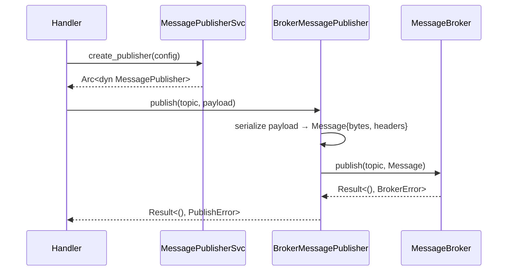
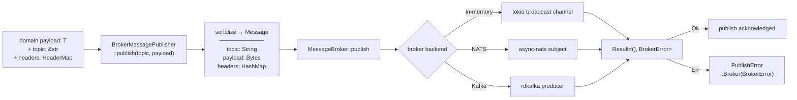

# Architecture — edge-egress-message-broker

## Sequence

> A domain handler obtains a `MessagePublisher` from the factory and publishes a typed message to a topic; the publisher delegates to the underlying broker backend.

## Data Flow

> A domain payload is wrapped into a `Message`, routed to the broker backend (in-memory / NATS / Kafka), and acknowledged.

